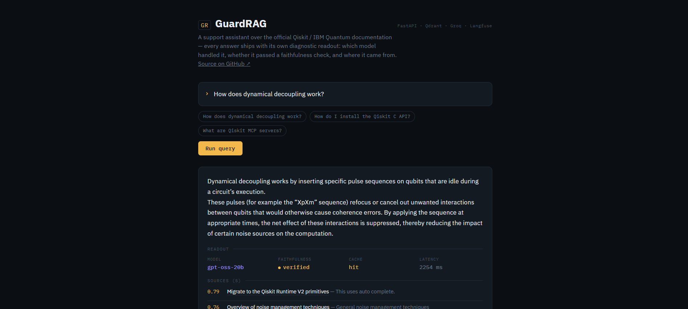
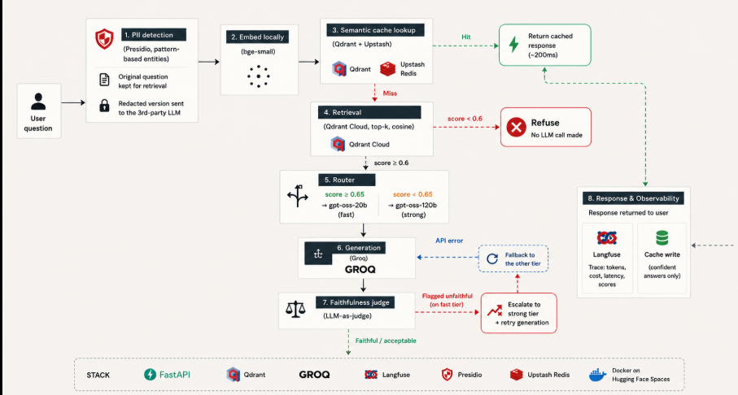

#  GuardRAG

**A production-grade RAG system not an answer-generation demo.**

Most RAG projects stop at "retrieve, then generate." GuardRAG is built around the layer that actually decides whether an LLM app survives contact with real users: catching hallucinations before they reach anyone, redacting PII before it leaves for a third-party API, routing for cost, caching for speed, and tracing every request so you can prove any of it works. The retrieval-and-generation core is the easy 20%. This project is the other 80%.

It runs over the official Qiskit / IBM Quantum documentation, is instrumented end to end, and was measured against a 54-question evaluation set on the **live deployment** — not on a laptop, not on cherry-picked examples.

 
 **Try it live:** https://layvay-guard-rag.hf.space/

 **Traces & cost dashboard:** [Langfuse](https://langfuse.com)
 
 **Stack:** FastAPI · Qdrant · Groq · Langfuse · Presidio · Upstash Redis · Docker on Hugging Face Spaces



---

## In 60 seconds

GuardRAG answers questions about Qiskit. The interesting part is everything wrapped around the answer:

- **It refuses instead of guessing.** Across 20 deliberately out-of-scope questions, it fabricated an answer **zero times** — stopped by two independent layers of defense.
- **It grades its own work.** Every answer is checked against its source by an LLM judge. Faithfulness held at **84–89%** across independent runs, and was cross-validated against blind human labeling with **100% agreement** (18/18).
- **It protects user data.** Emails, phone numbers, credit cards, IBANs, and IP addresses are redacted before anything reaches a third-party model — with **0% false positives** on clean input.
- **It controls cost.** A confidence-based router sends ~65% of traffic to a fast, cheap model and escalates to the stronger one only when needed. A semantic cache returns repeat questions in **~200ms**.
- **It's observable.** Tokens, cost, latency, and quality scores ship to Langfuse on every single request.

Full round-trip latency under normal load: **~1.7s p50 / ~3.8s p95.**

---

## What this project demonstrates

If you're matching this against a role, here's the short version of what I built and what it proves I can do:

| Competency | What's in this project |
|---|---|
| **LLMOps / production ML** | Guardrails, evaluation, observability, and cost control treated as core features rather than afterthoughts |
| **LLM safety & guardrails** | Hallucination detection (LLM-as-judge), grounded refusal gating, and PII redaction — each independently measured, not assumed |
| **Evaluation rigor** | A golden-set eval harness run against the live system, with results cross-validated against blind human labels and thresholds calibrated from measured data |
| **Backend engineering** | A FastAPI service where every external call (LLM, judge, cache, Redis) degrades gracefully into a fallback instead of crashing the request |
| **Retrieval & vector search** | Qdrant Cloud, local embeddings (bge-small), cosine retrieval behind a calibrated confidence gate |
| **Cost & resilience engineering** | Multi-model routing with automatic fallback and escalation, plus a TTL'd semantic cache that refuses to store degraded answers |
| **Observability** | End-to-end Langfuse tracing across generation, judging, and caching |

**Tech stack:** FastAPI · Qdrant Cloud · Groq (`gpt-oss-20b` / `gpt-oss-120b`) · Langfuse · Presidio · Upstash Redis · sentence-transformers (`bge-small-en-v1.5`) · Hugging Face Spaces (Docker)

---

## Why it exists

The hard part of running an LLM application in production isn't generating an answer  it's everything around that: catching hallucinations before they reach a user, redacting PII before it hits a third-party API, controlling cost, knowing when something breaks, and proving any of it actually works. GuardRAG makes that layer visible. Every answer ships with a readout of how it was produced, not just the answer.

I chose the Qiskit corpus on purpose. It's a domain I can personally verify  when the system reports a faithfulness rate, I can check it against my own quantum computing background instead of trusting a number blindly.

---

## Results

Measured against a 54-question golden set (12 in-scope, 20 out-of-scope, 3 ambiguous, 18 with embedded PII across 6 entity types, 1 prompt-injection probe), run through `eval/run_eval.py` against the live deployment across multiple independent runs. Full methodology, raw results, and the question set live in [`eval/`](./eval).

| Metric | Result |
|---|---|
| Out-of-scope questions never resulting in a fabricated answer | **100%** (20/20) |
| Out-of-scope caught by the retrieval-confidence gate specifically | **85%** (17/20) — the rest caught one layer later |
| In-scope questions correctly answered (not falsely refused) | **100%** (12/12) |
| Faithfulness rate (genuinely generated answers, clear judge verdict) | **84–89%**, consistent across two runs (16/19 and 16/18) |
| PII false-positive rate on clean questions | **0%** |
| PII true-positive rate — email, phone, credit card, IBAN, IP | **100%** (13/13) |
| PII true-positive rate — SSN specifically | **33%** (1/3) — isolated, reproducible recognizer gap |
| Latency, full round trip (p50 / p90 / p95) | **~1.7s / ~3.0s / ~3.8s** |
| Fast-tier (20B) vs strong-tier (120B) routing split | **~65% / ~35%** |

**Two findings worth calling out:**

*Defense in depth on refusal.* The retrieval-confidence gate (threshold 0.6, calibrated empirically — off-topic queries retrieved spurious matches around 0.50–0.54 cosine, genuine matches consistently 0.65+) caught 17/20 out-of-scope questions outright. The 3 it missed ("chemical formula for table salt," "how do I make a paper airplane," "how do I file my taxes") scored just above threshold on weak spurious matches — but in all 3, the generation layer's grounding instruction caught what the gate didn't and declined honestly rather than fabricating. Zero hallucinated answers across 20 out-of-scope questions, even when the first line of defense let something through. The very first eval run, before calibration, caught a real bug: an uncalibrated 0.5 threshold let 2/5 out-of-scope questions through to generation with no safety net at all.

*Faithfulness was cross-validated, not trusted at face value.* After diagnosing and fixing the judge's initial over-strictness (it was flagging reasonable hedged elaboration as "unsupported"), 18 answers were independently labeled by hand without seeing the judge's verdict, then compared: 100% agreement (18/18), including both confabulation cases the judge had caught.

---

## How it works

A question comes in, gets screened for PII, embedded locally, checked against a semantic cache, retrieved against the vector store, routed to the right model by confidence, generated, judged for faithfulness, and traced — with a fallback at every step that can fail.




### The guardrails, in detail

- **Faithfulness** — an LLM-as-judge call compares each answer against its retrieved context, with automatic fallback to the strong tier if the fast tier is down (otherwise the judge is a single point of failure — I found this out when a sustained Groq outage silently disabled it mid-eval). Honest refusals ("I don't have that information") are scored as faithful, not penalized, because declining isn't a false claim. The judge's verdicts were validated against blind human labeling (100% agreement) after an early version turned out over-strict; I rewrote the prompt to flag only claims that actually mislead, not claims that merely aren't verbatim in the context.
- **PII redaction** — restricted to pattern-based entities (email, phone, credit card, SSN, IBAN, IP) rather than NER categories (PERSON, LOCATION). An earlier NER-based version false-positived on domain vocabulary — "Qiskit" got misclassified as a person's name and redacted out of questions, wrecking retrieval. Switching to structural patterns eliminated that whole failure class.
- **Refusal** — gated on retrieval confidence, calibrated against measured spurious-match scores, and backed by a second line of defense in the generation prompt.

### Cost & resilience

- **Semantic cache** (Qdrant for similarity matching, Upstash Redis for TTL'd storage) — repeat and near-duplicate questions skip retrieval and generation entirely, returning in ~200ms instead of ~1–2s.
- Cache writes are skipped for degraded responses (API fallback failures, unverifiable faithfulness), so a bad answer never gets permanently cached.
- Every external call is wrapped to fail gracefully — a Redis or Groq hiccup degrades a single response instead of taking down the request.
- Routing includes automatic fallback to the other tier on API error, and automatic escalation from fast to strong when the judge flags a fast-tier answer.

---

## Engineering judgment: what I built, what I left out, and why

I'd rather document the edges of this system than pretend it doesn't have any. Each of these is a deliberate decision with a clear next step.

- **SSN recognition is weak (1/3).** Presidio's SSN recognizer is context-sensitive and caught only one of three synthetic SSNs, while the other five entity types caught 13/13. It's an isolated, reproducible gap — documented as exactly that, not inflated into a vaguer "PII detection is unreliable" claim it doesn't deserve.
- **Latency holds under interactive use, not sustained load.** Single-user latency is a steady ~1.7–3.8s, but the free Groq tier throttles hard under rapid sequential load — the eval harness itself had to add pacing, and a 33-call run still hit a sustained outage (12/33 generations failing on both tiers at once). A production deployment would need a paid tier or request queuing.
- **No reranking stage.** Retrieval is single-pass cosine similarity. A cross-encoder rerank would likely help on ambiguous queries, but the eval never showed retrieval precision as the dominant failure mode — so I left it out deliberately rather than adding it speculatively.
- **No CI/CD or full A/B testing.** A/B testing isn't statistically meaningful without real production traffic. A lightweight CI step that reruns the eval on every push would have real signal — it'd catch faithfulness regressions automatically — and it's the first thing I'd add.

### What I'd build next, with more time or budget

- A cross-encoder reranking stage before generation, **if** a future eval shows retrieval precision (not generation or the judge) as the dominant failure mode.
- A paid LLM tier to remove the rate-limit ceiling that constrained the eval harness itself.
- Kubernetes deployment — the original target, scaled back to Hugging Face Spaces for a zero-cost path.
- A CI step rerunning the eval on every push, to catch faithfulness regressions automatically.

---

## Run it locally

```bash
git clone https://github.com/Abdellah-elm/guard_RAG.git
cd guard_RAG
docker compose up -d          # Qdrant + Redis for local dev
pip install -r requirements.txt
python -m spacy download en_core_web_sm
cp .env.example .env          # fill in your API keys
python ingestion/parse_qiskit_docs.py --docs-dir data/qiskit-docs/docs/guides --out data/chunks.jsonl
python ingestion/embed_and_index.py
uvicorn app.main:app --reload
```

Full setup details, including the Qdrant Cloud / Upstash migration path used for the live deployment, are in [`eval/`](./eval) and the inline comments in `app/main.py`.

The corpus is the official [Qiskit/documentation](https://github.com/Qiskit/documentation) (CC BY-SA 4.0).

---

## About

Built by **[Abdellah](https://github.com/Abdellah-elm)** as a reference implementation of LLMOps practices , guardrails, observability, and cost control as first-class features, not afterthoughts.

